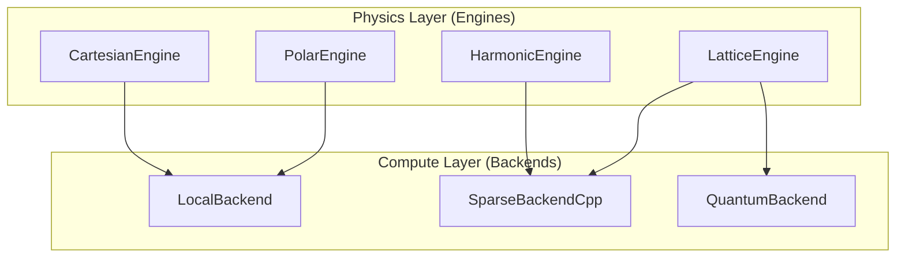

# Arquitectura Engine + Backend

**Fecha:** 2025-12-01
**Estado:** Implementado (Fase 1)

## Resumen

Atheria 4 separa claramente la lógica de física (**Engines**) de la infraestructura de cómputo y almacenamiento (**Backends**). Esto permite cambiar la implementación subyacente (CPU, GPU, C++, QPU) sin modificar las reglas de la simulación.

## Conceptos Clave

### 1. Physics Engines (Física)

Definen **CÓMO** se comportan las partículas y campos. Contienen las reglas de evolución, la interpretación de estados y la lógica de interacción.

* **`CartesianEngine`** (antes `Aetheria_Motor`): Implementación estándar de QCA en grid cartesiano. Usa redes neuronales (U-Net/ConvLSTM) para la evolución.
* **`PolarEngine`**: Optimizado para estabilidad rotacional y simetría radial.
* **`HarmonicEngine`**: Basado en interferencia de ondas y QFT procedural.
* **`LatticeEngine`**: Implementa física de Lattice Gauge Theory (AdS/CFT) con actualización Metropolis-Hastings.

### 2. Compute Backends (Cómputo/Almacenamiento)

Definen **DÓNDE** y **CÓMO** se ejecutan los cálculos y se almacenan los datos.

* **`LocalBackend`**: Ejecución local estándar (PyTorch CPU/GPU).
* **`SparseBackendCpp`**: Almacenamiento disperso optimizado en C++ (atheria_core) con tensores nativos.
* **`SparseBackendCppV2`**: Versión mejorada de V1.
* **`QuantumBackend`** (Futuro): Ejecución en QPUs reales (IonQ, IBM).

## Diagrama de Arquitectura



## Implementación

La selección se realiza en `motor_factory.py`. El usuario elige un `ENGINE_TYPE` y opcionalmente un `BACKEND_TYPE`.

```python
# Ejemplo conceptual
engine = MotorFactory.create(
    engine_type='HARMONIC',
    backend_type='CPP'
)
```

## Beneficios

1. **Flexibilidad**: Ejecutar la misma física en CPU para debug y en GPU/C++ para producción.
2. **Escalabilidad**: Agregar soporte para nuevos aceleradores (TPU, LPU) solo requiere un nuevo Backend.
3. **Claridad**: Separa la complejidad de la física de la complejidad de la optimización.
