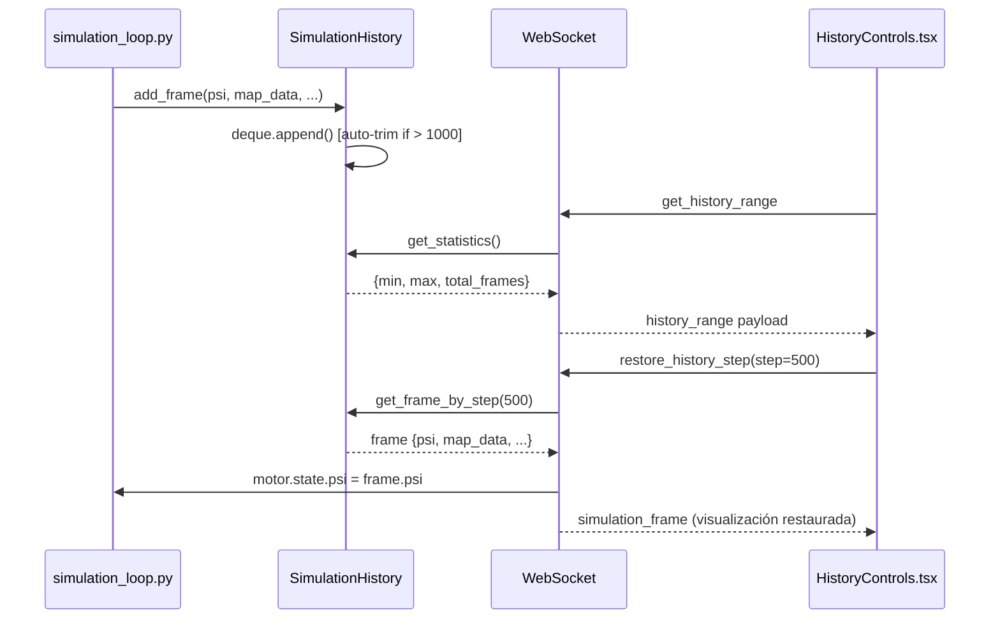

# HISTORY BUFFER ARCHITECTURE

Sistema de buffer circular en memoria para navegación temporal (rewind/replay) de simulaciones cuánticas en Atheria.

## Visión General

El sistema de historia permite **rebobinar y reproducir** estados anteriores de la simulación sin necesidad de re-ejecutar desde el inicio. Esto se logra mediante un buffer circular en memoria que almacena los últimos N estados de simulación, incluyendo el estado cuántico completo (`psi`) para restauración exacta.

## Arquitectura

### Backend

#### `SimulationHistory` (src/managers/history_manager.py)

**Buffer Circular Eficiente:**
- Usa `collections.deque(maxlen=max_frames)` para operaciones O(1)
- Capacidad: 1000 frames (configurable)
- Auto-eliminación de frames antiguos al alcanzar límite
- Almacena:
  - `step`: Número de paso de simulación
  - `timestamp`: Marca de tiempo
  - `map_data`: Datos de visualización (downsampled si necesario)
  - `hist_data`: Histogramas y métricas
  - `psi`: Estado cuántico completo (tensor PyTorch en CPU)

**Por qué `psi` en CPU:**
- Evita saturar VRAM del GPU con estados históricos
- Permite buffer más grande sin afectar rendimiento de simulación
- Se transfiere de vuelta al GPU solo al restaurar

#### Integración con `simulation_loop.py`

```python
# Después de cada step, agregar al historial
history_payload = frame_payload_raw.copy()
if psi is not None:
    history_payload['psi'] = psi.detach().cpu()
g_state['simulation_history'].add_frame(history_payload)
```

**Frecuencia de captura:** 
- Se captura cada frame enviado al frontend (respeta `steps_interval`)
- Balance entre granularidad y uso de memoria

#### Handlers WebSocket (src/pipelines/handlers/history_handlers.py)

**`handle_get_history_range`**
- **Propósito:** Informar al frontend qué rango de steps está disponible
- **Retorna:** `min_step`, `max_step`, `total_frames`, `current_step`
- **Llamado:** Periódicamente (cada 5s) por el frontend

**`handle_restore_history_step`**
- **Propósito:** Restaurar simulación a un step anterior
- **Proceso:**
  1. Buscar frame más cercano con `get_frame_by_step(target_step)`
  2. Pausar simulación (`is_paused = True`)
  3. Restaurar `motor.state.psi` desde el frame (si disponible)
  4. Actualizar `g_state['simulation_step']`
  5. Enviar visualización actualizada al frontend

**Soporte de Motores:**
- ✅ **Motor Python:** Restauración completa de estado cuántico
- ⚠️  **Motor Nativo (C++):** Solo visualización (restauración completa pendiente)

### Frontend

#### `HistoryControls.tsx` (frontend/src/modules/History/)

**Componente de Navegación Temporal:**

**Controles:**
- **Slider:** Navegación directa a cualquier step disponible
- **Play/Pause:** Reanudar/pausar simulación en vivo
- **Step Backward:** Retroceder 10 steps
- **Step Forward:** Avanzar 10 steps

**Estado:**
- `historyRange`: Rango de steps disponibles (del backend)
- `selectedStep`: Step actualmente seleccionado (local)
- `isPlaying`: Estado de reproducción

**Sincronización:**
- Escucha `history_range` del backend (actualización cada 5s)
- Escucha `inference_status_update` para sincronizar estado
- Al soltar slider: envía `restore_history_step` al backend

**Integración:**
- Renderizado en `DashboardLayout.tsx`
- Posicionado entre viewport y `MetricsBar`
- Solo visible en tab `'lab'`

## Flujo de Datos



## Decisiones de Diseño

### ¿Por qué `deque` en lugar de lista?

- **O(1) append/pop:** Crucial para updates en tiempo real cada frame
- **Auto-limitación:** `maxlen` maneja eliminación de frames antiguos automáticamente
- **Ordenamiento garantizado:** Los frames están siempre en orden temporal

### ¿Por qué almacenar `psi` completo?

- **Restauración exacta:** Permite retomar simulación desde cualquier punto
- **No re-cálculo:** Evita re-ejecutar steps anteriores (costoso computacionalmente)
- **Limitación:** Solo para motor Python (motor nativo usa representación sparse)

### Trade-offs

**Ventajas:**
- ✅ Navegación instantánea a cualquier punto de la historia
- ✅ No requiere re-ejecutar simulación
- ✅ Buffer circular auto-gestionado

**Limitaciones:**
- ⚠️  Uso de RAM proporcional a `max_frames × grid_size²`
- ⚠️  Motor nativo: solo visualización (no restauración completa)
- ⚠️  Frames más antiguos se eliminan al superar límite

## Uso

### Desde el Frontend

1. Abrir pestaña "Lab"
2. Ejecutar simulación para generar historia
3. Usar controles de timeline:
   - Arrastrar slider a step deseado
   - Presionar Step Backward/Forward
4. Presionar Play para reanudar desde ese punto

### Desde el Backend (Desarrollo)

```python
# Obtener estadísticas
stats = g_state['simulation_history'].get_statistics()
# {'min_step': 0, 'max_step': 1000, 'total_frames': 1000}

# Obtener frame específico
frame = g_state['simulation_history'].get_frame_by_step(500)
# {'step': 500, 'psi': Tensor(...), 'map_data': [...], ...}

# Limpiar historia
g_state['simulation_history'].clear()
```

## Extensiones Futuras

- [ ] Guardar buffer a disco para persistencia entre sesiones
- [ ] Compresión de frames antiguos (menos frecuentes)
- [ ] Restauración para motor nativo (conversión dense→sparse)
- [ ] Marcadores/bookmarks de steps importantes
- [ ] Exportar animación de rango de frames

## Referencias

- [[SimulationHistory]]: `src/managers/history_manager.py`
- [[simulation_loop]]: `src/pipelines/core/simulation_loop.py`
- [[history_handlers]]: `src/pipelines/handlers/history_handlers.py`
- [[HistoryControls]]: `frontend/src/modules/History/HistoryControls.tsx`
