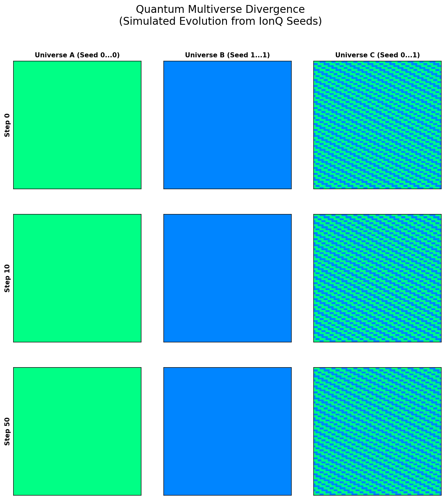

# Quantum Multiverse (Many Worlds Simulation)

**Quantum Multiverse** is a feature in Atheria that leverages the **Batch Inference Engine** and **IonQ** to simulate the "Many Worlds" interpretation of quantum mechanics.

Instead of simulating a single timeline, we use a quantum computer to generate a **superposition of initial conditions**. When we measure this superposition (collapse), we get a probability distribution of outcomes. In Atheria, we use these outcomes to seed **multiple parallel universes** simultaneously.

## Theoretical Basis

### The Measurement Problem
In standard Copenhagen interpretation, a measurement collapses the wavefunction into a single state. In the **Many Worlds Interpretation (MWI)**, all possible outcomes of a quantum measurement are realized in some "world" or universe.

### Implementation: IonQ + Batch Engine

1.  **Quantum Source**: We execute a quantum circuit on IonQ that puts qubits into a complex superposition (Hadamard + Entanglement).
2.  **Measurement**: We measure the circuit multiple times (`shots`). Each "shot" represents one possible reality that *could* have happened.
3.  **Branching**: Instead of discarding the variations, we map each unique shot (or distribution of shots) to a separate simulation instance in our `BatchInferenceEngine`.
4.  **Parallel Evolution**: We evolve all these N universes simultaneously on the GPU.

## Key Components

### 1. `initialize_from_ionq_multiverse`
Located in `src/engines/batch_inference_engine.py`.
-   Executes a single job on IonQ with `shots=N_universes`.
-   This is highly efficient: 1 API call generates seeds for N simulations.
-   Ensures that the divergence between universes is **truly quantum** (based on wavefunction collapse probabilities) rather than pseudo-random.

### 2. Quantum Noise Buffer
Located in `src/physics/noise.py`.
-   To support "Hybrid Simulation" (continuous quantum interference), we maintain a buffer of quantum entropy.
-   We fetch ~11,000 bits of entropy in a single IonQ call and consume them gradually.
-   This allows for real-time "Quantum Injection" without network latency blocking the simulation loop.

### 3. Hybrid Evolution
Located in `src/engines/qca_engine.py` (`evolve_hybrid_step`).
-   Periodically injects quantum noise into the simulation.
-   Represents "Quantum Tunneling" or non-local events that prevent the universe from getting stuck in cyclic attractors.

## Usage

### In Batch Mode
When starting a batch experiment:
-   Select **"Quantum Genesis"** mode.
-   The system will contact IonQ.
-   You will see N simulations start, initially similar but diverging over time due to the quantum seed differences ("Butterfly Effect").

### In Training
-   The **Quantum Noise Injector** forces the AI (Ley M) to learn robust physics that can survive quantum fluctuations.

## Future Directions: Time as Superposition

We are exploring using the batch dimension not just for *spatial* variations, but to represent **Temporal Superposition**:
-   Simulating different *future* timelines from the *same* present state.
-   Allowing the user to "peek" into possible futures and choose the timeline they prefer (Quantum Steering).
