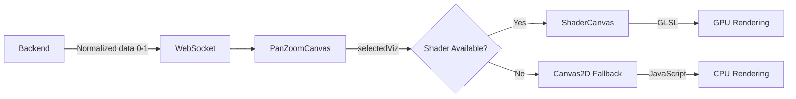

# WebGL Shaders Guide

Guía completa para trabajar con shaders WebGL en el proyecto Atheria, incluyendo arquitectura, templates, y best practices.

---

## 📋 Visión General

Atheria usa **WebGL shaders** para renderizar visualizaciones de campos cuánticos con aceleración GPU. Los shaders convierten datos normalizados (0-1) del backend a colores usando GLSL (OpenGL Shading Language).

**Performance Impact:** 4-12x speedup vs CPU rendering (Canvas2D).

---

## 🏗️ Arquitectura

### Frontend Components

```
frontend/src/
├── utils/
│   └── shaderVisualization.ts     # Shader definitions (GLSL)
├── components/ui/
│   ├── ShaderCanvas.tsx           # WebGL rendering engine
│   └── PanZoomCanvas.tsx          # Shader activation logic
```

### Flow



---

## 🎨 Shader Template

### Vertex Shader (Reusable)

```glsl
// frontend/src/utils/shaderVisualization.ts
export const VERTEX_SHADER = `
  attribute vec2 a_position;    // Position in clip space [-1,1]
  attribute vec2 a_texCoord;    // Texture coordinates [0,1]
  varying vec2 v_texCoord;      // Pass to fragment shader
  
  void main() {
    gl_Position = vec4(a_position, 0.0, 1.0);
    v_texCoord = a_texCoord;
  }
`;
```

### Fragment Shader (Customizable)

**Template para nuevo shader:**

```glsl
export const FRAGMENT_SHADER_MYNAME = `
  precision mediump float;
  uniform sampler2D u_texture;   // Data texture from backend
  varying vec2 v_texCoord;       // Texture coords from vertex shader
  
  // Helper functions (optional)
  vec3 myColorMapping(float value) {
    // Tu lógica de color aquí
    return vec3(value, value, value);  // Ejemplo: grayscale
  }
  
  void main() {
    // 1. Sample data texture
    float data = texture2D(u_texture, v_texCoord).r;
    
    // 2. Apply color mapping
    vec3 color = myColorMapping(data);
    
    // 3. Output final color
    gl_FragColor = vec4(color, 1.0);
  }
`;
```

---

## 📦 Existing Shaders

### 1. Density Shader (Blue-Yellow)

**Uso:** Density visualization  
**Colormap:** Blue (0.0) → Yellow (1.0)

```glsl
void main() {
  float density = texture2D(u_texture, v_texCoord).r;
  vec3 baseColor = mix(
    vec3(0.0, 0.0, 0.5),     // Dark blue
    vec3(1.0, 1.0, 0.0),     // Bright yellow
    density
  );
  gl_FragColor = vec4(baseColor, 1.0);
}
```

### 2. HSV Phase Shader

**Uso:** Phase visualization con color wheel  
**Colormap:** H=phase [0,1], S=1.0, V=1.0

```glsl
vec3 hsvToRgb(float h, float s, float v) {
  h = mod(h, 1.0) * 6.0;
  float c = v * s;
  int hi = int(floor(h));
  float f = h - float(hi);
  
  // Color wheel logic (6 cases)
  vec3 rgb;
  if (hi == 0) rgb = vec3(c, c * f, 0.0);
  else if (hi == 1) rgb = vec3(c * (1.0 - f), c, 0.0);
  // ... (otros casos)
  
  return rgb + (v - c);
}

void main() {
  float phase = texture2D(u_texture, v_texCoord).r;
  vec3 color = hsvToRgb(phase, 1.0, 1.0);
  gl_FragColor = vec4(color, 1.0);
}
```

### 3. Real/Imaginary Shader

**Uso:** Re(ψ) / Im(ψ) visualization  
**Colormap:** Blue (negative) → Yellow (positive)

```glsl
void main() {
  float value = texture2D(u_texture, v_texCoord).r;
  vec3 color = mix(
    vec3(0.0, 0.0, 1.0),     // Blue (negative)
    vec3(1.0, 1.0, 0.0),     // Yellow (positive)
    value
  );
  gl_FragColor = vec4(color, 1.0);
}
```

---

## 🔧 Adding a New Shader

### Step 1: Define Shader in `shaderVisualization.ts`

```typescript
export const FRAGMENT_SHADER_MYNEWSHADER = `
  precision mediump float;
  uniform sampler2D u_texture;
  varying vec2 v_texCoord;
  
  void main() {
    float data = texture2D(u_texture, v_texCoord).r;
    // Tu color mapping aquí
    vec3 color = vec3(data);
    gl_FragColor = vec4(color, 1.0);
  }
`;
```

### Step 2: Import in `ShaderCanvas.tsx`

```typescript
import { FRAGMENT_SHADER_MYNEWSHADER } from '../../utils/shaderVisualization';
```

### Step 3: Add to Shader Selection Logic

```typescript
let fragmentShader = FRAGMENT_SHADER_DENSITY; // default

if (selectedViz === 'density') {
  fragmentShader = FRAGMENT_SHADER_DENSITY;
} else if (selectedViz === 'mynewshader') {
  fragmentShader = FRAGMENT_SHADER_MYNEWSHADER;  // ← AGREGAR AQUÍ
}
```

### Step 4: Enable in `PanZoomCanvas.tsx`

```typescript
// Remover 'mynewshader' de exclusion list si está presente
const shaderShouldBeAvailable = !['poincare', 'flow'].includes(selectedViz);
```

### Step 5: Verify Backend Support

Ensure backend sends correct normalized data for your visualization in `src/pipelines/viz/core.py:select_map_data()`.

---

## 🎯 Best Practices

### Performance

1. **Keep GLSL Simple:** GPU parallelization works best with simple per-pixel operations
2. **Avoid Conditionals:** Use `mix()` instead of `if/else` when possible
3. **Normalize Data:** Backend should send [0,1] normalized data
4. **Texture Size:** Match texture size to grid size (no upsampling in shader)

### Color Mapping

1. **Use Scientific Colormaps:** Viridis, Plasma, Inferno (perceptually uniform)
2. **Avoid Rainbow:** Not perceptually uniform, bad for data visualization
3. **Consider Colorblind Users:** Test with colorblind simulators

### Debugging

```javascript
// Enable WebGL error checking
const gl = canvas.getContext('webgl', { debug: true });

// Check shader compilation
if (!gl.getShaderParameter(shader, gl.COMPILE_STATUS)) {
  console.error('Shader compilation error:', gl.getShaderInfoLog(shader));
}
```

---

## 📊 Performance Comparison

| Method      | Grid Size | FPS  | Use Case                     |
|-------------|-----------|------|------------------------------|
| WebGL       | 256×256   | ~60  | Real-time visualization      |
| WebGL       | 512×512   | ~60  | High-res visualization       |
| Canvas2D    | 256×256   | ~15  | Fallback only                |
| Canvas2D    | 512×512   | ~5   | Not recommended              |

**Rule of Thumb:** Always prefer WebGL shaders for grid > 128×128.

---

## 🔗 References

- [[FIELD_VISUALIZATIONS]] - Conceptos de visualización de campos
- [[VISUALIZATION_PIPELINE]] - Pipeline completo de visualización
- [WebGL Fundamentals](https://webglfundamentals.org/)
- [GLSL Reference](https://www.khronos.org/opengl/wiki/OpenGL_Shading_Language)

---

## 💡 Future Enhancements

- [ ] Dynamic colormap selection (user-configurable)
- [ ] Multi-channel textures (combine Re+Im in single texture)
- [ ] Compute shaders for advanced effects
- [ ] 3D volumetric rendering
