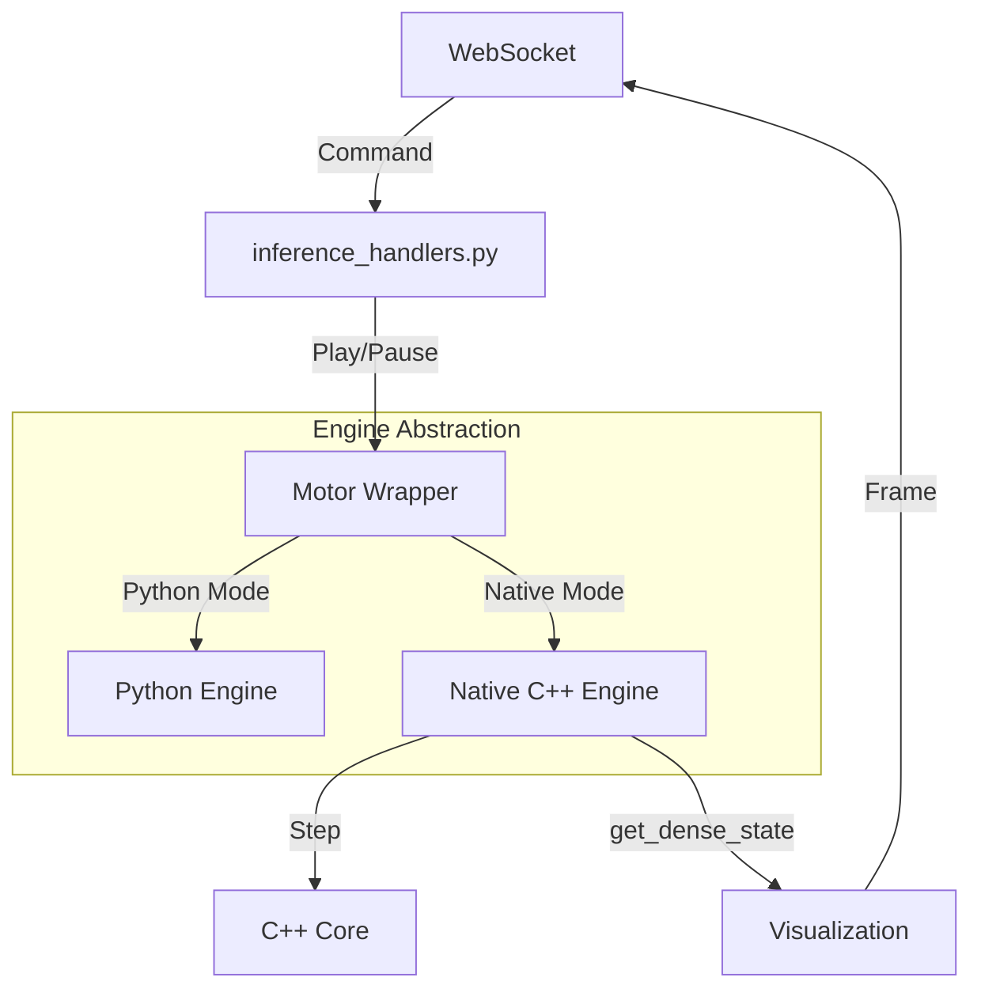

# Inference Handlers Architecture

This document describes the architecture of inference handlers in Atheria 4, focusing on `inference_handlers.py` and its interaction with the native C++ engine.

## Overview

Inference handlers manage the simulation lifecycle (Play, Pause, Reset, Load) and handle communication between the frontend (WebSocket) and the backend engines (Python/C++).

### Key Responsibilities

1.  **Command Processing**: Receives commands from WebSocket (`play`, `pause`, `reset`, etc.).
2.  **Engine Management**: Manages both Python `Aetheria_Motor` and Native C++ `atheria_core`.
3.  **State Synchronization**: Ensures the frontend visualization matches the backend state.
4.  **Error Handling**: Robustly handles timeouts, engine failures, and fallbacks.

## Architecture

### Command Flow

### Native vs. Python Engine

The system supports two engines:

1.  **Python Engine (`Aetheria_Motor`)**:
    *   Pure Python/PyTorch implementation.
    *   Used for prototyping and fallback.
    *   State is always dense (Tensor).

2.  **Native Engine (`NativeEngineWrapper` -> `atheria_core`)**:
    *   High-performance C++ implementation using LibTorch.
    *   Uses **Sparse Representation** internally (`matter_map_`).
    *   **Lazy Conversion**: Converts sparse state to dense grid only when needed (e.g., for visualization).

### Key Optimizations

#### 1. Lazy Conversion & ROI
Conversion from the native sparse format to dense tensors is expensive (O(N)).
*   **Lazy**: `get_dense_state()` only converts if the state has changed since the last call.
*   **ROI (Region of Interest)**: Can convert only a visible sub-region of the grid.
*   **Streaming**: Large conversions are done in batches to avoid blocking the event loop.

#### 2. Non-Blocking Validation
Previously, `handle_play` called `get_dense_state` to validate the engine, causing timeouts.
*   **Fix**: Use `model_loaded` flag (boolean) and `get_matter_count()` (O(1)) for validation.
*   **Async**: Initial frame sending is done asynchronously with a long timeout (30s) so it doesn't block the UI.

## Troubleshooting

### Common Issues

1.  **"Ghost Particles" / Empty Engine**
    *   **Symptom**: `get_matter_count()` returns > 0, but `get_dense_state()` returns zeros.
    *   **Cause**: Issues with `add_particle` in C++ or threshold mismatch in Python wrapper.
    *   **Fix**: `test_native_state_recovery.py` diagnoses this. Check `native_engine_wrapper.py` threshold settings.

2.  **WebSocket Timeout on Play**
    *   **Symptom**: Frontend disconnects when pressing Play on large grids.
    *   **Cause**: Blocking conversion in the main thread.
    *   **Fix**: Ensure `handle_play` uses async frame sending and lightweight validation.

3.  **Visual Artifacts / Black Screen**
    *   **Symptom**: Simulation runs but screen is black.
    *   **Cause**: `map_data` empty or range is 0.
    *   **Fix**: Check `get_dense_state` timeout handling and fallback logic.

## Reference

*   `src/pipelines/handlers/inference_handlers.py`: Main handler logic.
*   `src/engines/native_engine_wrapper.py`: Wrapper for C++ engine.
*   `test_native_state_recovery.py`: Diagnostic tool.
